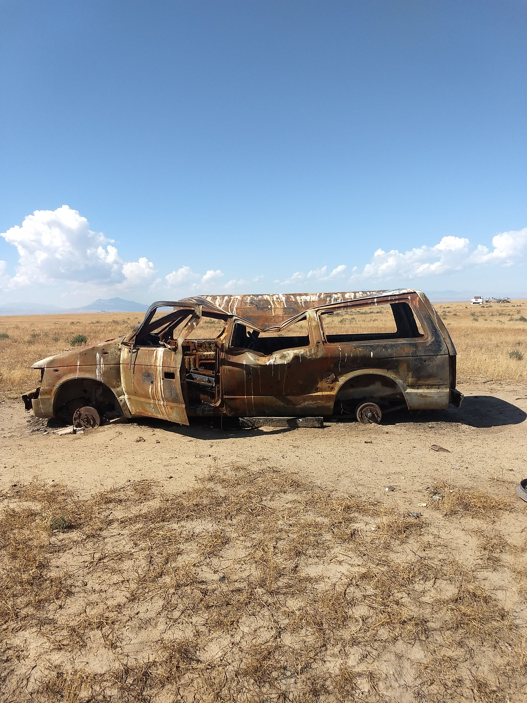

Dryland ecology is full of great views. Here is a picture of a car.


```{r eval=F, include=F}
# this renders the site into the _site directory, which github pages doesn't like
# so I'm currently just copying everything back into the base directory
rmarkdown::render_site()

```

```{r show-image-local,echo=FALSE,fig.align='center',out.width='95%'}

```